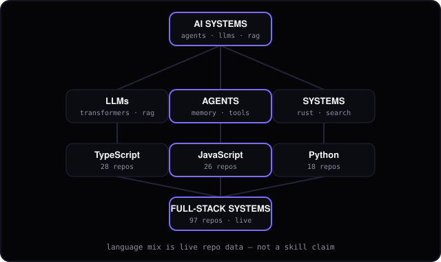
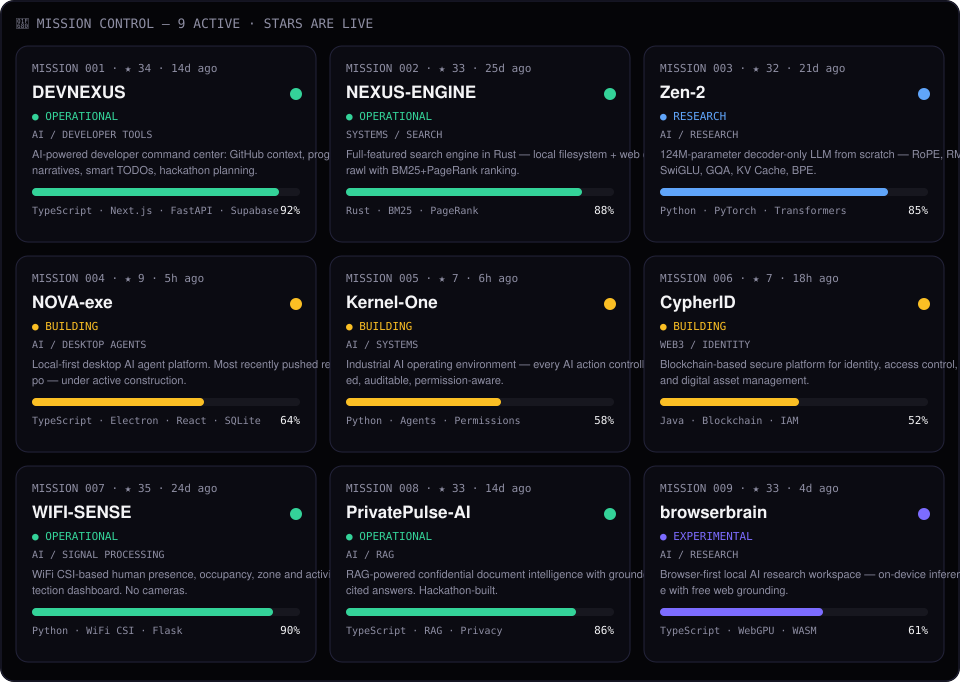
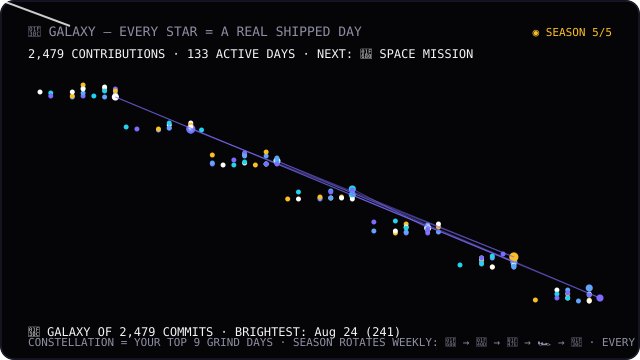
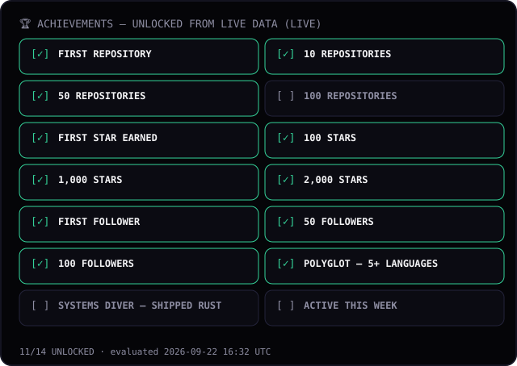
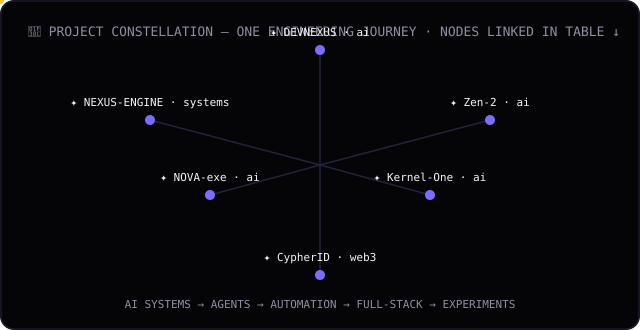

<!-- BK // DEVELOPER OS — living profile. Every dynamic value lives between OS markers and is regenerated from the real GitHub API by scripts/generate-os.mjs (CI every 6h). Edit prose/structure freely; never hand-edit numbers inside markers. -->
<p align="center"><code>BK // DEVELOPER OS — ● ONLINE</code></p>

[](https://vincenzo-afk.vercel.app/)

<h1 align="center">BHARANI KUMAR</h1>
<p align="center"><b>Full Stack Developer · AI Systems Builder · Researcher</b></p>

> Building intelligent software, automation systems, developer tools, and AI-powered systems at the intersection of software engineering and emerging technology.
>
> *Build intelligent systems that solve real problems rather than simply wrapping an API.*

<p align="center">
  <a href="#-mission-control">PROJECTS</a> ·
  <a href="#-research-lab">RESEARCH</a> ·
  <a href="https://github.com/vincenzo-afk?tab=repositories">GITHUB</a> ·
  <a href="https://vincenzo-afk.vercel.app/">PORTFOLIO</a>
</p>

<p align="center">
  <b>WARP MENU — click anything, everything flies somewhere:</b><br/>
  🖥️ <a href="https://vincenzo-afk.vercel.app/">Portfolio</a> ·
  📦 <a href="https://github.com/vincenzo-afk?tab=repositories">All Repos</a> ·
  ⭐ <a href="https://github.com/vincenzo-afk?tab=stars">Starred</a> ·
  👥 <a href="https://github.com/vincenzo-afk?tab=followers">Followers</a> ·
  🏆 <a href="https://github.com/vincenzo-afk?tab=achievements">Achievements</a> ·
  📊 <a href="https://github.com/vincenzo-afk">Contribution Graph</a>
</p>

---
## 🎮 PLAYER PROFILE

<!-- OS:player -->
```text
PLAYER ............ Bharani Kumar S (@vincenzo-afk)
CLASS ............. Full Stack Developer / AI Engineer
SPECIALIZATION .... AI Systems · LLMs · Agents · Automation
LOCATION .......... Tamil Nadu, India
OBJECTIVE ......... Build useful systems beyond the demo.
STATUS ............ ● BUILDING (vincenzo-afk pushed 4h ago)

PRIMARY ........... AI Systems
ACTIVE ............ Full Stack Engineering
EXPLORING ......... Systems / Rust
EXPERIMENTAL ...... Speech / Multimodal / Blockchain identity
```
<!-- /OS:player -->

---
## 🧠 SKILL TREE

[](#-loadout)

<!-- OS:skill-mix -->
Live language mix behind this tree (real repo data, Sep 2026): **TypeScript 29 · JavaScript 26 · Python 19 · Rust 3 · HTML 3 · CSS 2 · Dart 2 · Kotlin 2 · Java 1** — 99 public repos. Language counts describe the repos, not skill claims.
<!-- /OS:skill-mix -->

---
## ⚡ LIVE TELEMETRY

[](https://github.com/vincenzo-afk)

<!-- OS:telemetry-table -->
| Metric | Live value (2026-09-23) | Source |
|---|---|---|
| Public repositories | **99** | `api.github.com/users/vincenzo-afk` |
| Stars earned | **2,752** | sum of `stargazers_count` over all repos |
| Contributions (1y) | **2,498** | public contribution graph (parsed, no auth) |
| Followers / Following | **127 / 103** | user profile |
| Forks | **12** | sum of `forks_count` |
| Last push | **vincenzo-afk, 4h ago** | repos sorted by `pushed_at` |
| Fresh builds | vincenzo-afk · ascii-terminal · browserbrain | last 3 pushes |

Regenerated every 6h by `.github/workflows/update-profile.yml`. If the API is unreachable the cards show the last known state instead of an error.
<!-- /OS:telemetry-table -->

---
## 🚀 MISSION CONTROL

[](https://github.com/vincenzo-afk?tab=repositories)

<!-- OS:missions-table -->
| # | Mission | Status | Live repo |
|---|---|---|---|
| 001 | **DEVNEXUS** — AI-powered developer command center: GitHub context, progress narratives, smart TODOs, hackathon planning. | ● OPERATIONAL | [vincenzo-afk/DEVNEXUS](https://github.com/vincenzo-afk/DEVNEXUS) · 37★ · 20d ago |
| 002 | **NEXUS-ENGINE** — Full-featured search engine in Rust — local filesystem + web crawl with BM25+PageRank ranking. | ● OPERATIONAL | [vincenzo-afk/NEXUS-ENGINE](https://github.com/vincenzo-afk/NEXUS-ENGINE) · 36★ · 1mo ago |
| 003 | **Zen-2** — 124M-parameter decoder-only LLM from scratch — RoPE, RMSNorm, SwiGLU, GQA, KV Cache, BPE. | ● RESEARCH | [vincenzo-afk/Zen-2](https://github.com/vincenzo-afk/Zen-2) · 35★ · 28d ago |
| 004 | **NOVA-exe** — Local-first desktop AI agent platform. Most recently pushed repo — under active construction. | ● BUILDING | [vincenzo-afk/NOVA-exe](https://github.com/vincenzo-afk/NOVA-exe) · 16★ · 5d ago |
| 005 | **Kernel-One** — Industrial AI operating environment — every AI action controlled, auditable, permission-aware. | ● BUILDING | [vincenzo-afk/Kernel-One](https://github.com/vincenzo-afk/Kernel-One) · 16★ · 5d ago |
| 006 | **CypherID** — Blockchain-based secure platform for identity, access control, and digital asset management. | ● BUILDING | [vincenzo-afk/CypherID](https://github.com/vincenzo-afk/CypherID) · 17★ · 4d ago |
| 007 | **WIFI-SENSE** — WiFi CSI-based human presence, occupancy, zone and activity detection dashboard. No cameras. | ● OPERATIONAL | [vincenzo-afk/WIFI-based-human-presence-detection-system](https://github.com/vincenzo-afk/WIFI-based-human-presence-detection-system) · 38★ · 1mo ago |
| 008 | **PrivatePulse-AI** — RAG-powered confidential document intelligence with grounded, cited answers. Hackathon-built. | ● OPERATIONAL | [vincenzo-afk/PrivatePulse-AI](https://github.com/vincenzo-afk/PrivatePulse-AI) · 37★ · 4d ago |
| 009 | **browserbrain** — Browser-first local AI research workspace — on-device inference with free web grounding. | ● EXPERIMENTAL | [vincenzo-afk/browserbrain](https://github.com/vincenzo-afk/browserbrain) · 36★ · 2d ago |

Progress bars are manual build estimates; stars + last-push are live from the API. Edit `data/projects.json` to change the manifest.
<!-- /OS:missions-table -->

---
## 🛰️ SPACE MISSION — CURRENT SEASON

[](https://github.com/vincenzo-afk)

<!-- OS:season-note -->
**🌌 NOW PLAYING: GALAXY** — fueled by **2,498 real contributions** across **135 active days**. Season rotates automatically every week: 🚀 SPACE MISSION → 🐍 SNAKE RUN → 👾 PAC-MAN → 🏎️ CODE RACING → 🌌 GALAXY. Next up: **🚀 SPACE MISSION**. The game changes; the grind data never lies.
<!-- /OS:season-note -->

## 🎮 LEVEL SYSTEM *(custom profile gamification — not an official GitHub score)*

<!-- OS:level -->
```text
BK // LEVEL 9

XP  ██████████░░░░░░░░░░░░  45%  (10,737 XP)

REPOS ×99 ............ +20 XP each
STARS ×2,752 ......... +2 XP each
FOLLOWERS ×127 ....... +5 XP each
GRIND ×2,498 .... +1 XP each
```
<!-- /OS:level -->

---
## 🏆 ACHIEVEMENTS

[](https://github.com/vincenzo-afk?tab=achievements)

<!-- OS:achievements-note -->
Rules live in `data/achievements.json` and are evaluated against live data — 11/14 unlocked, `100 REPOSITORIES` still locked. No invented unlocks.
<!-- /OS:achievements-note -->

---
## 🧪 RESEARCH LAB

<!-- OS:research -->
```text
INVESTIGATING
  AI Agents · Speech AI · AI Systems · Systems · Multimodal AI

EXPERIMENTING
  MCP · Local LLMs · Tool Calling · Agent Memory · Browser AI

UNDERSTANDING
  Transformers · RAG · Inference · Distributed Systems · Compilers
```

> **CURRENT RESEARCH:** How far can autonomous software agents operate reliably without continuous human intervention?
<!-- /OS:research -->

---
## ⚔️ LOADOUT

<!-- OS:loadout -->
```text
EQUIPPED
  TypeScript · Python · React/Next.js · FastAPI · PyTorch · Transformers · RAG · MCP · Agents · PostgreSQL · Redis · Docker · GitHub Actions

CURRENTLY LEARNING
  Rust · Systems · Search ranking (BM25/PageRank) · Distributed training

EXPERIMENTAL
  Speech AI · Multimodal AI · WebGPU/WASM inference · WiFi CSI sensing · On-chain identity
```
<!-- /OS:loadout -->

---
## 📡 LIVE TRANSMISSIONS

Real public events, refreshed by the pipeline (`data/transmissions.json`):

<!-- OS:transmissions -->
```text
12:05  deleted branch in ascii-terminal
12:03  created branch in ascii-terminal
12:05  merged PR #1 in ascii-terminal
12:05  pushed to ascii-terminal
12:04  opened PR #1 in ascii-terminal
02:13  deleted branch in browserbrain
01:31  pushed to browserbrain
```
<!-- /OS:transmissions -->

---
## 🌐 SYSTEM STATUS

<!-- OS:sysstatus -->
```text
┌─────────────────────────────────────┐
│ SYSTEM STATUS                       │
├─────────────────────────────────────┤
│ GitHub            ● CONNECTED       │
│ Profile pipeline  ● ONLINE          │
│ NOVA-exe          ● DEVELOPMENT     │
│ Kernel-One        ● DEVELOPMENT     │
│ CypherID          ● DEVELOPMENT     │
│                                     │
│ LAST SYNC         2026-09-23 UTC    │
└─────────────────────────────────────┘
```

Health is verified read-only by `.github/workflows/health-check.yml` — it fails the run rather than ever rendering `undefined`/`NaN` to visitors.
<!-- /OS:sysstatus -->

### Daily Ops — real checks, committed daily

<!-- OS:ops -->
```text
LAST OPS CHECK .... 2026-09-23 UTC
PORTFOLIO ......... ● ONLINE (HTTP 200, 188ms)
MISSIONS .......... 9/9 reachable via API
VERDICT ........... ● ALL SYSTEMS NOMINAL
```
<!-- /OS:ops -->

---
## 🌌 PROJECT CONSTELLATION

[](https://github.com/vincenzo-afk?tab=repositories)

```text
AI SYSTEMS → AGENTS → AUTOMATION → FULL-STACK → EXPERIMENTS
```

Every node links back to its mission row above — one engineering journey, not isolated repos.

---
## 📖 DEVELOPER LORE

<!-- OS:lore -->
```text
2025
└── Account created Sep 2025 — first repos, full-stack experiments, Developer-OS portfolio

2025-26
└── AI systems enter the lab — NOVA, Zen-2 (124M LLM from scratch), OpenAgentNet, AgentWeb

2026
└── 99 public repos, 2700+ stars — search engines in Rust, WiFi sensing, RAG, agent infrastructure

NOW
└── Building systems instead of demos — vincenzo-afk, ascii-terminal, browserbrain in active development
```
<!-- /OS:lore -->

---
## 🧠 CURRENTLY

<!-- OS:currently -->
```text
🔨 BUILDING ...... NOVA-exe — local-first desktop AI agent platform (TypeScript + Electron + React + SQLite)
🧪 EXPERIMENTING  Autonomous tool-using agents with auditable, permission-aware execution (Kernel-One)
📚 LEARNING ...... Systems + Rust (NEXUS-ENGINE search engine: BM25 + PageRank)
🔍 RESEARCHING ... How far autonomous software agents can operate reliably without continuous human intervention
🎯 NEXT .......... Ship something people actually use
```

Controlled by `data/profile.json` — no code changes needed.
<!-- /OS:currently -->

---
## 🎯 QUEST BOARD

<!-- OS:quests -->
```text
MAIN QUEST
━━━━━━━━━━━━━━━━━━━━━━
Build a genuinely useful AI system
STATUS: IN PROGRESS

SIDE QUESTS
━━━━━━━━━━━━━━━━━━━━━━
□ Ship Kernel-One as a permission-aware AI execution environment
□ Push NOVA-exe to a stable local-first release
□ Scale Zen-2 beyond 124M params with a reproducible pipeline
□ Publish technical research notes on agents + retrieval
□ Contribute to open-source AI tooling
```
<!-- /OS:quests -->

---
## 🧪 EXPERIMENT OF THE WEEK

<!-- OS:experiment -->
```text
┌──────────────────────────────────────────┐
│ 🧪 EXPERIMENT OF THE WEEK                │
│                                          │
│ Can an LLM autonomously research a       │
│ technical question using grounded tools  │
│ while maintaining source reliability?    │
│                                          │
│ VEHICLE: AgentWeb + browserbrain                  │
│ STATUS: RUNNING                                  │
└──────────────────────────────────────────┘
```
<!-- /OS:experiment -->

---
## 📊 DEVELOPER TELEMETRY

<!-- OS:top-repos -->
Top repositories by stars (live, 2026-09-23) — click any row to warp in:

| Repo | ★ | Lang | Last push |
|---|---|---|---|
| [WIFI-based-human-presence-detection-system](https://github.com/vincenzo-afk/WIFI-based-human-presence-detection-system) | 38 | Python | Aug 23 |
| [PORTFOLIO](https://github.com/vincenzo-afk/PORTFOLIO) | 38 | HTML | Aug 22 |
| [vincenzo-afk](https://github.com/vincenzo-afk/vincenzo-afk) | 37 | JavaScript | Sep 23 |
| [PrivatePulse-AI](https://github.com/vincenzo-afk/PrivatePulse-AI) | 37 | TypeScript | Sep 19 |
| [KingstonConnect](https://github.com/vincenzo-afk/KingstonConnect) | 37 | TypeScript | Sep 10 |
| [xithsense](https://github.com/vincenzo-afk/xithsense) | 37 | Python | Sep 03 |
| [DEVNEXUS](https://github.com/vincenzo-afk/DEVNEXUS) | 37 | TypeScript | Sep 03 |
<!-- /OS:top-repos -->

<details>
<summary><b>🥚 Easter eggs</b> — three hidden discoveries</summary>

```text
$ whoami
bharani — full-stack developer / ai systems builder

$ ls
projects/ experiments/ research/ unfinished-ideas/
```

```text
↑ ↑ ↓ ↓ ← → ← → B A
... something hums in the telemetry deck ...
```

```text
> ACCESS LEVEL: ????
  [ CLASSIFIED — mission 010 pending first contact ]

ERROR 404
Normal developer README not found.
Something better was installed.
```

</details>

---

<!-- OS:footer -->
```
────────────────────────────────────────
BK.DEV SYSTEM · VERSION 26.09.23
LAST SYNCHRONIZED 2026-09-23 UTC · SOURCE api.github.com/users/vincenzo-afk
Built with: GitHub API · GitHub Actions · Node · SVG · SMIL
[ SOURCE ] [ PROJECTS ] [ CONTACT: itsmebk2007@gmail.com ]
────────────────────────────────────────
```
<!-- /OS:footer -->
